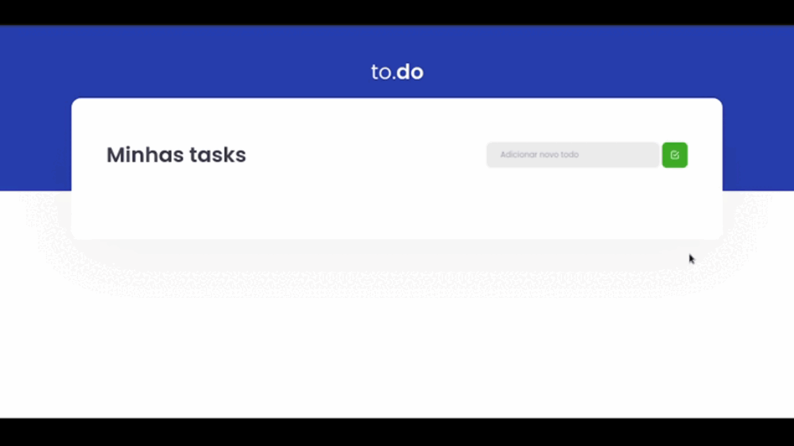
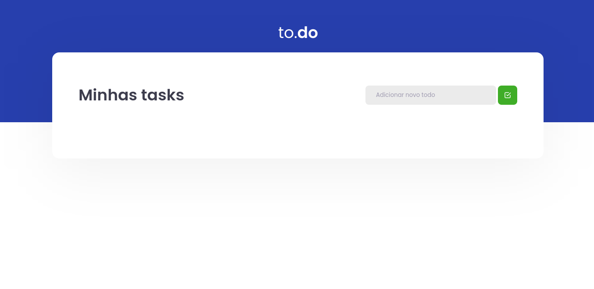
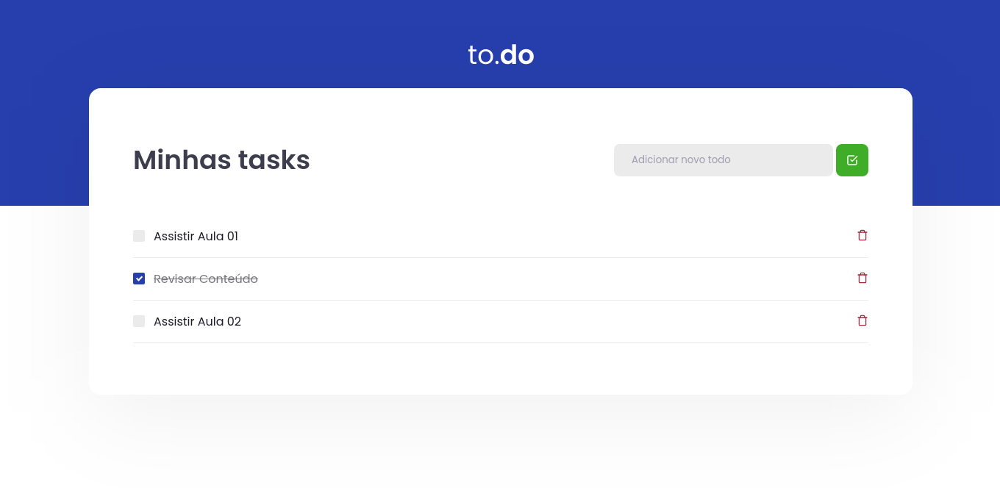

<h4 align="center"> 
	Desafio 01 - To-Do 
</h4>

<p align="center">
  
  
  
  
  <a href="https://www.linkedin.com/in/paulobeckman/">
    
  </a>
	
  
  <a href="https://github.com/paulobeckman/to-do/commits/master">
    
  </a>

  
   <a href="https://github.com/paulobeckman/to-do/stargazers">
    
  </a>
</p>
 
 ## 💻 Sobre o projeto

 Essa aplicação foi feita como desafio durante o curso ignite da rocketseat. 
 Essa é uma aplicação onde o principal objetivo é uma pequena aplicação de atividades a fazer, permitindo-me treinar um pouco mais sobre manipulação do estado no React.
 
 Foi desenvolvido, nessa aplicação, as as seguintes funcionalidades: 
- Adicionar uma nova tarefa
- Remover uma tarefa
- Marcar e desmarcar uma tarefa como concluída.

 ### Web

<p align="center" style="display: flex; align-items: flex-start; justify-content: center;">
	
  
		
  

  
</p>

### Pré-requisitos

Antes de começar, você vai precisar ter instalado em sua máquina as seguintes ferramentas:
[Git](https://git-scm.com), [Node.js][nodejs] e o [Yarn][yarn]
Além disto é bom ter um editor para trabalhar com o código como [VSCode][vscode]


### 🎲 Rodando a aplicação web

```bash
# Clone este repositório
$ git clone https://github.com/paulobeckman/to-do.git

# Acesse a pasta do projeto no terminal/cmd
$ cd to-do

# Instale as dependências
$ yarn

# Execute a aplicação em modo de desenvolvimento
$ yarn dev

# O servidor inciará na porta:8080 - acesse http://localhost:8080 
```


## 📝 Licença

Este projeto esta sobe a licença MIT. Veja a [LICENÇA](license) para saber mais.

Feito por Paulo Beckman 👋🏽 [Entre em contato!](https://www.linkedin.com/in/paulobeckman/)

[nodejs]: https://nodejs.org/
[yarn]: https://yarnpkg.com/
[vscode]: https://code.visualstudio.com/
[license]: https://opensource.org/licenses/MIT